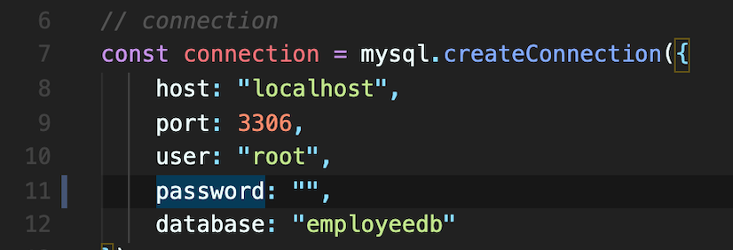

# employeeTracker

## Description
The goal of this project is to build a command-line application to manage a company's employee database, using Node.js, Inquirer, and MySQL.

## Installation

npm install --save mysql2

npm install inquirer

npm install console.table --save

### Link to Repo

https://github.com/bctan87/employeeTracker

1. Download the file
2. Install dependencies
3. Include your SQL password on line 11

4. Set up the SQL table (schema and seeds)
5. Enter npm start

## Demo Video

https://drive.google.com/file/d/1FAA1MUo8w3n2esaxeqOjsWFQpXPoiVba/view

## Credits

https://www.w3schools.com/

https://developer.mozilla.org/en-US/

https://htmlcheatsheet.com/js/

https://stackoverflow.com/

https://codepen.io/

https://leetcode.com

https://eloquentjavascript.net/

https://www.udemy.com/course/advanced-javascript-concepts/

https://medium.com/javascript-in-plain-english/the-20-most-popular-programming-articles-of-2020-289d22fbd35e

https://nodejs.org/en/download/

https://www.npmjs.com/package/inquirer

https://www.npmjs.com/package/mysql2

https://www.npmjs.com/package/console.table

